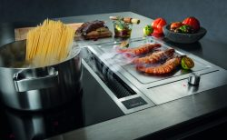
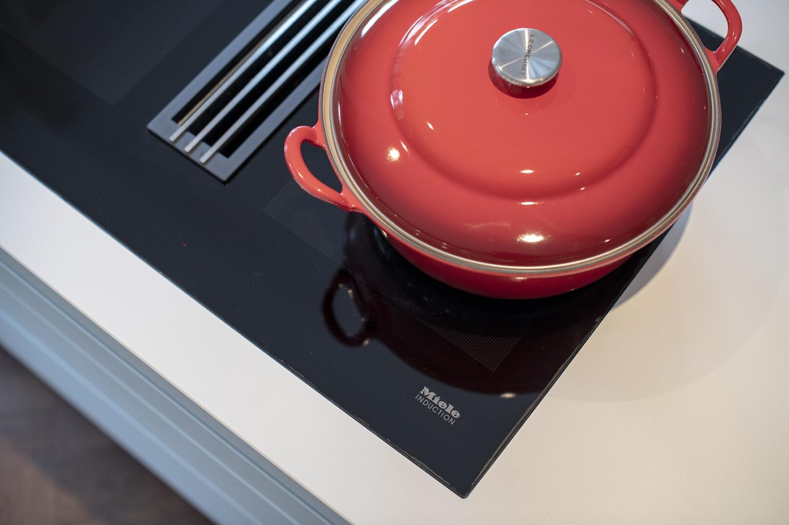
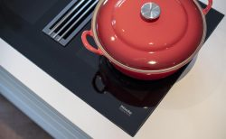
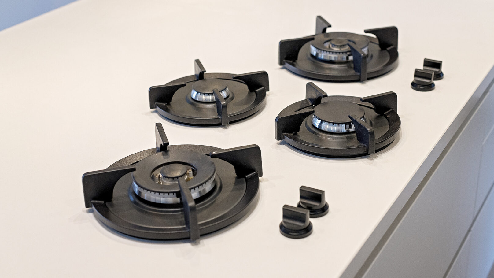
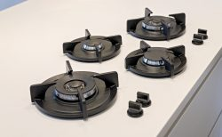

# De beste apparatuur voor in uw keuken

Om met plezier te kunnen koken heb je naast een praktische indeling ook goede apparatuur nodig. Wij helpen u graag om een goede keuze te maken zodat u jarenlang hiervan kunt genieten.

[**Atag**](http://www.atag.nl) staat voor kwaliteit van eigen bodem. Een breed programma in het midden-prijssegment. Met name ijzersterk in gaskookplaten die bijzonder prettig koken en makkelijk schoon te houden zijn, met als uitschieter de nieuwe vulcano wokbrander. Als Atag partner bieden wij u vanaf 4 apparaten 8 jaar garantie.

[**Gaggenau**](http://www.gaggenau.com/nl/) is de oudste fabrikant van inbouwovens en staat al jaren aan de top. Een merk voor kookfanaten en mensen met smaak voor eten en goede vormgeving. Het paradepaard van Gaggenau is de combistoomoven, deze biedt een gezonde en smaakvolle bereidingswijze in combinatie met gebruiksgemak en veelzijdige culinaire toepassingen, zoals hetelucht met stoom en kerntemperatuurmeter.

[**Miele**](http://www.miele.nl) heeft inbouwapparatuur in het midden en hogere prijssegment van hoogstaande kwaliteit. Een bijzonder fraaie vormgeving hebben de compacte apparaten van Miele waaronder combimagnetrons, stoomovens en koffie/espressoapparaten.[**Neff**](http://www.neff.nl/) heeft een bijzonder uitgebreid en veelzijdig programma aan inbouwapparaten speciaal afgestemd op de kookliefhebber. Bijzonder zijn de hide and slide oven en de vertikale koppellijsten om van twee apparaten één geheel te maken. Een goede kwaliteit en service zijn vanzelfsprekend bij Neff.

Voor koel- en vriesapparatuur zijn wij dealer van het specialistenmerk [**Liebherr**](http://www.koelen.nl/) . Dit omvat een zeer breed programma aan inbouw koelkasten en vriezers, met kenmerken zoals het biofresh gedeelte en het no-frost systeem. Daarnaast leveren wij ook wijnkasten.

Een bijzondere oplossing om kookluchtjes direct naar beneden af te zuigen biedt het merk**[Bora]**[.](https://www.bora.com/nl-nl) Uniek is de inductiekookplaat met ingebouwde afzuiging.

Ook leveren wij [**Novy**](http://www.novynederland.nl/) ,**[EMB]**[,](http://www.emb-edelstahlmoebel.de/) en [**Wave**](http://www.wavedesign.nl/)  afzuigsystemen. Voor wie graag op gas kookt leveren wij o.a. [**Pitt cooking**](http://www.pittcooking.nl/)  , in het werkblad geïntegreerde gaspitten met ruime panafstand.

Naast de praktische en mooie bulthaup kraan leveren wij ook de kokendwaterkranen van [**Quooker**](http://www.quooker.nl/nl) . Deze energie zuinige systemen kunnen vaak uw huidige keukenboiler vervangen.

[Twitter](https://twitter.com/keukendesigner)[Instagram](https://www.instagram.com/stadshaege.keukendesign/)[Facebook](https://www.facebook.com/stadshaege/)
