# Dè Bulthaup keukenzaak van Amersfoort

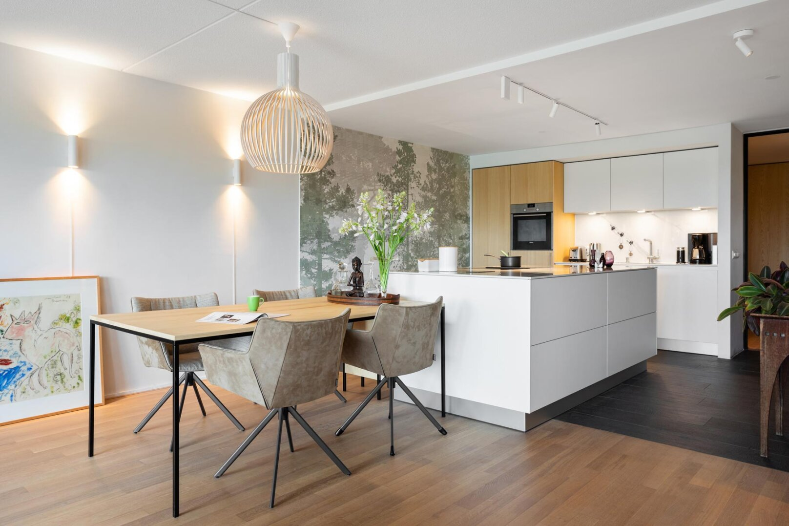

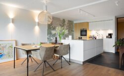

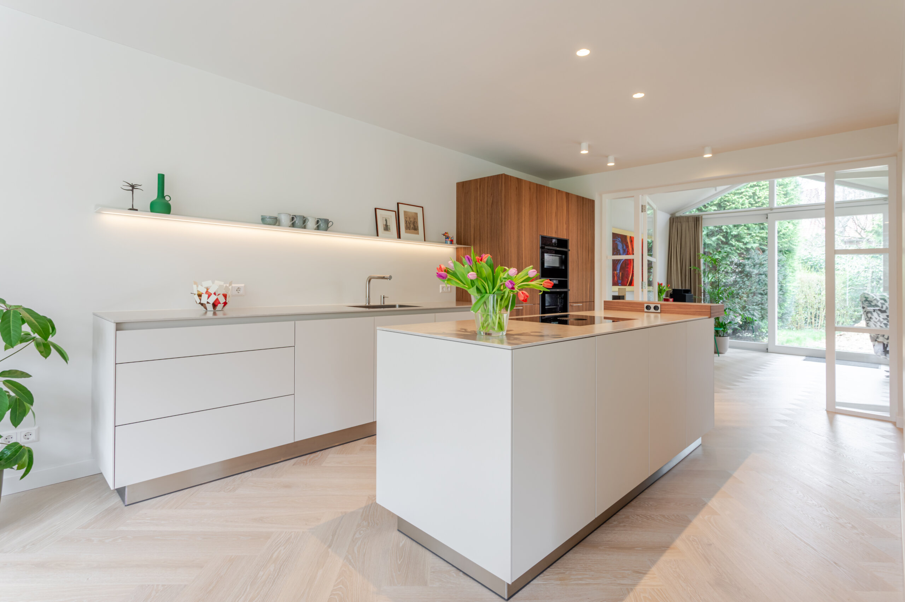

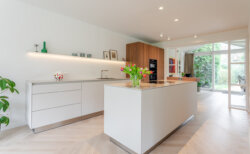

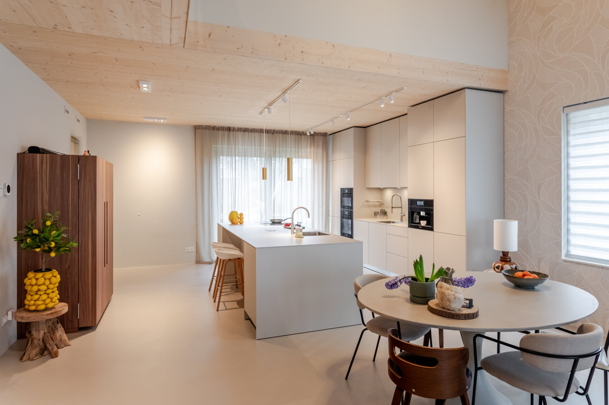

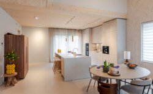

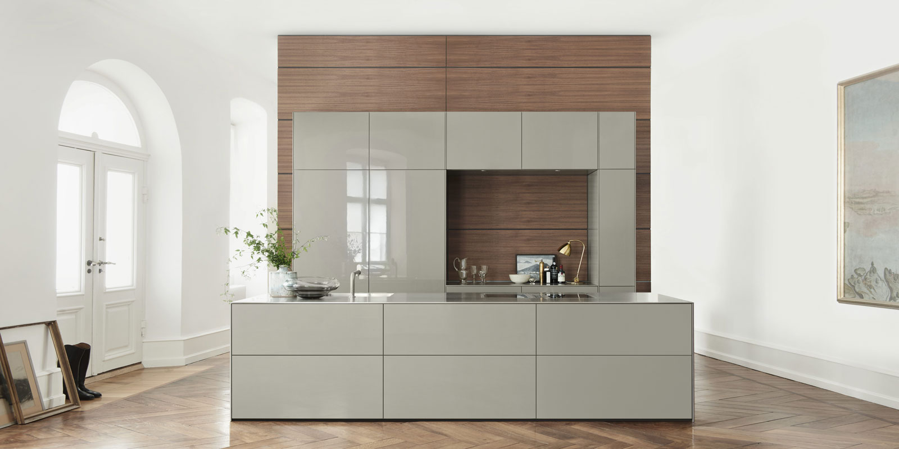

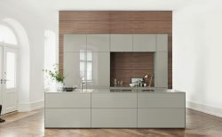

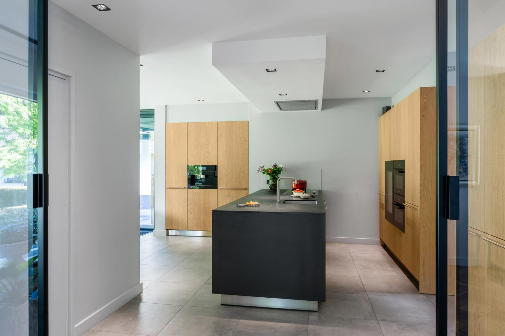

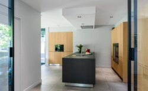

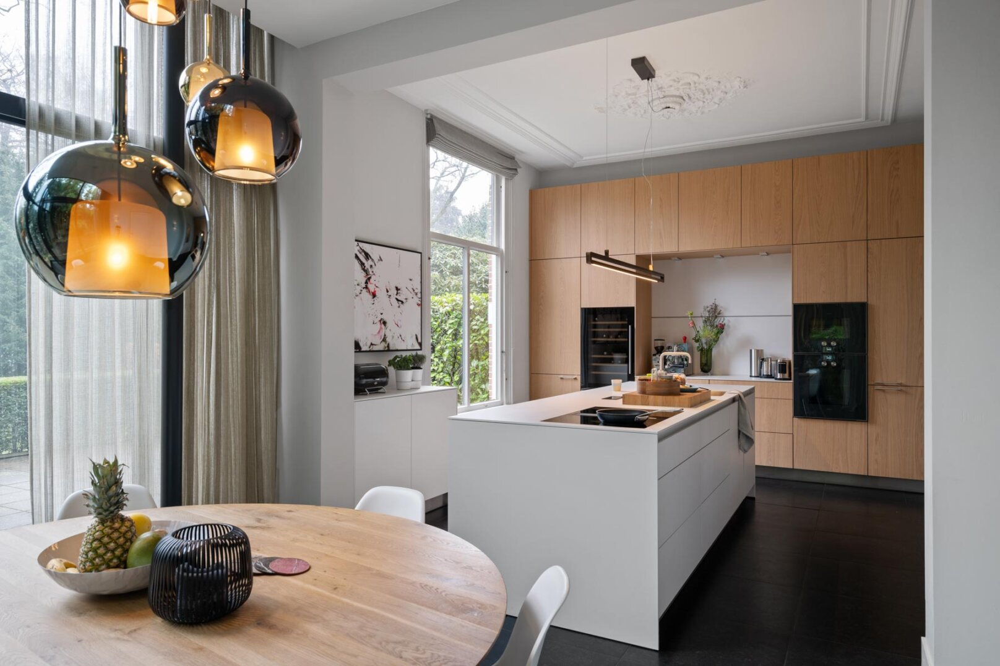

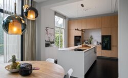

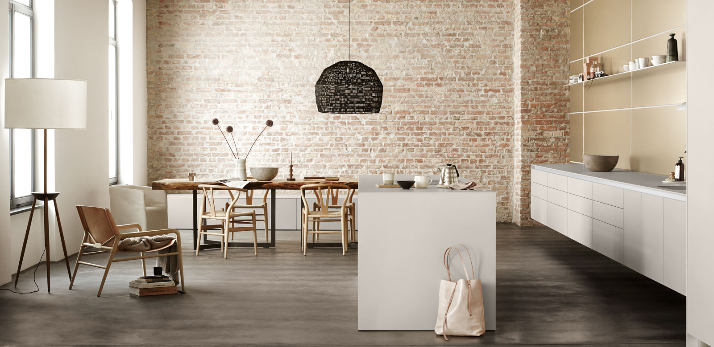

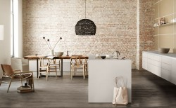

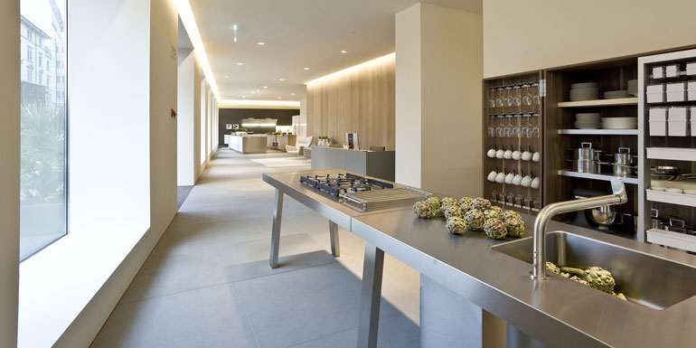

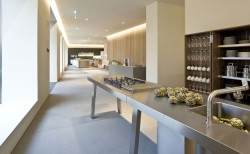

Het b2 systeem bestaat uit een werkbank en losse kasten voor apparatuur en keukengerei.

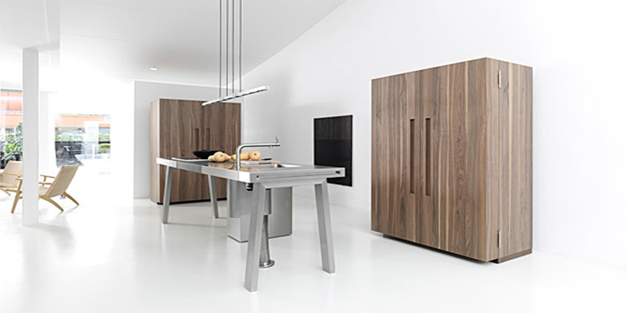

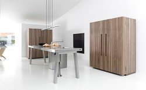

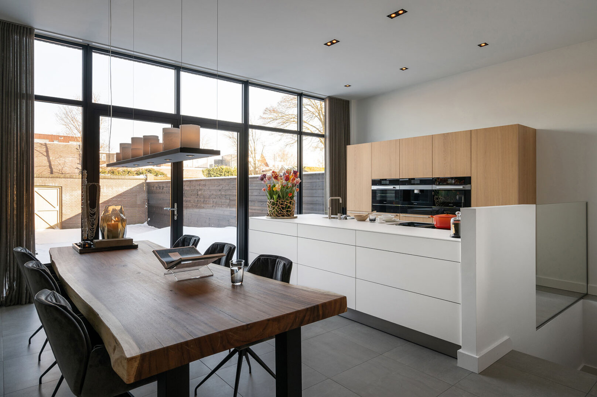

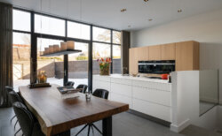

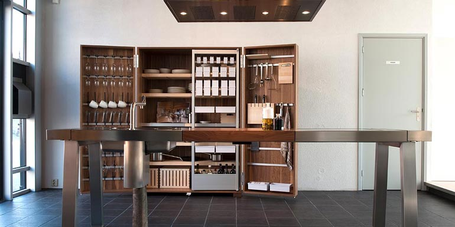

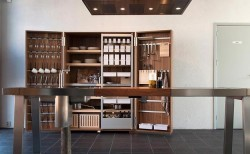

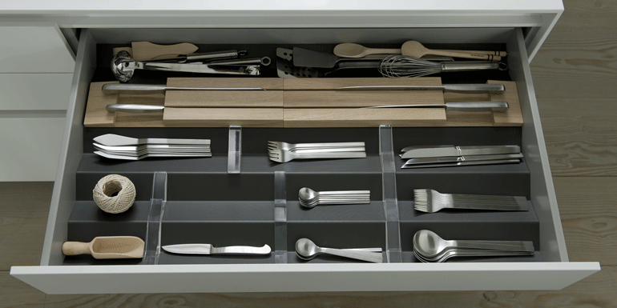

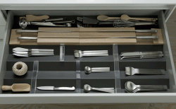

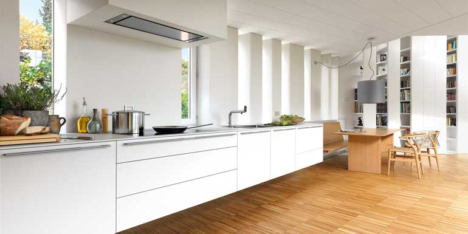

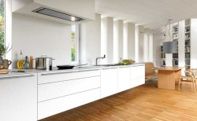

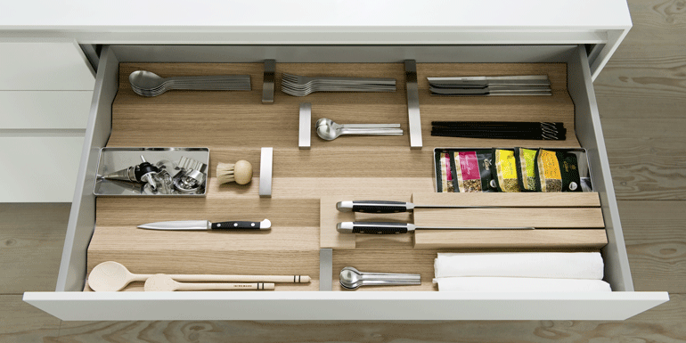

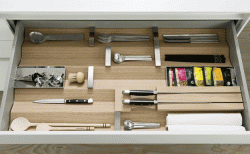

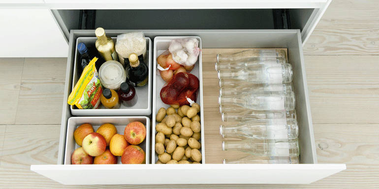

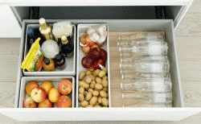

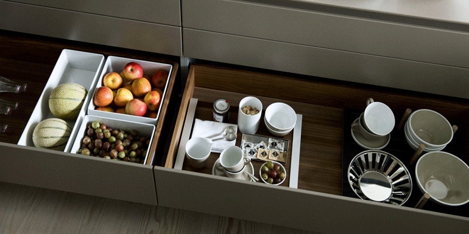

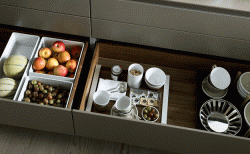

Bulthaup heeft keukensystemen met ieder een heel eigen vormgeving.**bulthaup b3**biedt oneindig veel variatie in kleuren, materialen en maten, de kasten staan op een plint, op poten of hangen aan de muur. De vormgeving is licht en strak, naar keuze met greepprofiel, touch grepen of handgrepen. De diversiteit aan oplossingen is ongekend, de ontwerpen hebben een mooie eenvoudige en sobere uitstraling. Er zijn fragiele zwevende elementen en massieve blokken die op de vloer staan mogelijk. De toplagen variëren van hoogwaardig roestvrijstaal, aluminium in verschillende tinten, sterke kunststof fronten met naadloze laserkanten, en oneindig veel lak kleuren in mat, velours of hoogglans. Bulthaup staat bekend om zijn bijzondere houtafdeling waar de fineermeester de zorgvuldig uitgekozen houtsoorten keurt en selecteert. Ze komen uit gecontroleerde productiebossen. De fineren worden met de hand tot fronten gemaakt en met watergedragen matte lak afgewerkt. De tekening van het hout loopt doorgaans door over de laden en kastfronten zodat de eenheid van het beeld zichtbaar blijft en de prachtige tekening van het hout optimaal tot zijn recht komt. [Hier een film](https://youtu.be/cbNBocuBtBM) over het handwerk bij bulthaup keukens.**prisma**is het nieuwe flexibele lade inrichtingssysteem van bulthaup, dit is in antraciet, eiken, notenhout en rvs leverbaar. De verdelers zijn er in glas, rvs en antraciet. Er zijn verschillende accessoires voor beschikbaar zoals inzetbakjes, kruidenpotjes, messenhouders, folierolhouders. Het mooie van dit prismaladesysteem is dat u de vrijheid heeft om de lades zelf in te richten een aan te passen aan uw kookgerei en spullen.**bulthaup b2**heet ook wel de keukenwerkplaats. Het is geïnspireerd door vroegere keukens in oude huizen en door de werkplaats van een timmerman. De vrijstaande werkkasten en de apparatenombouwkasten zijn verkrijgbaar in noten of eiken. De werkbank is van rvs met tussenliggend werkblad in hout, steen of rvs. In deze werkbank kunnen naar wens de spoelbak en kookplaat geplaatst worden.

De bulthaup keukensystemen hebben een geheel eigen vormtaal, duidelijk anders en onderscheidend van gangbare keukens. Vanuit een veelheid aan producten en materialen is voor iedere leefstijl en woonruimte een individuele keuken in te richten. De moderne en exclusieve keukens van bulthaup worden op maat gemaakt binnen een uitgebreid programma aan mogelijkheden.

Bezoek onze showroom voor meer informatie en inspiratie.

[Twitter](https://twitter.com/keukendesigner)[Instagram](https://www.instagram.com/stadshaege.keukendesign/)[Facebook](https://www.facebook.com/stadshaege/)
