# Al 40 jaar keukenspecialist

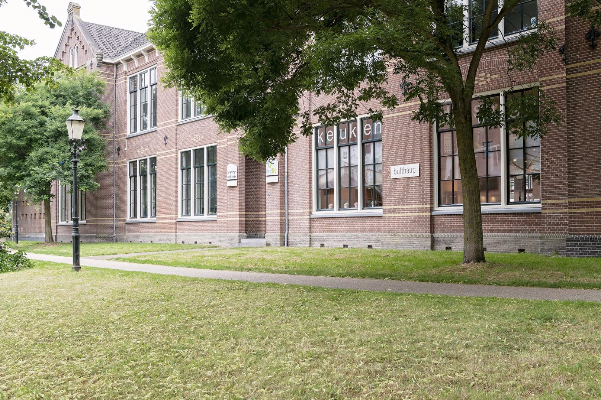

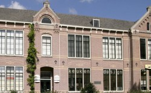

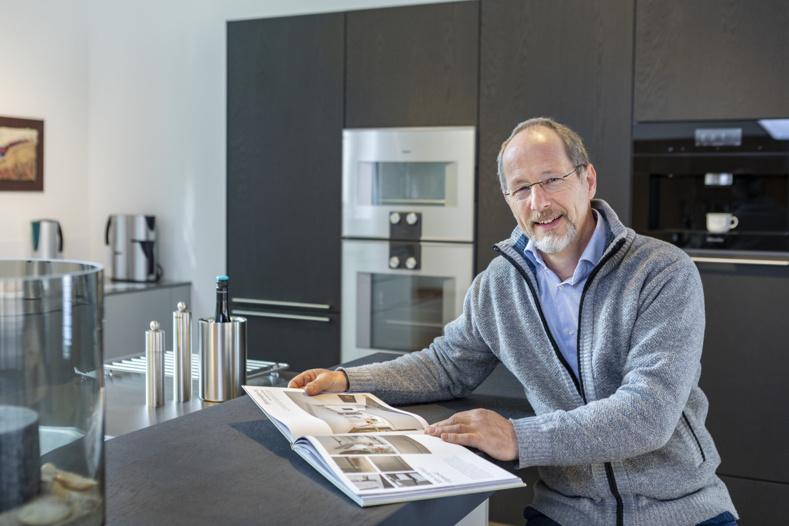

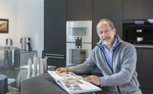

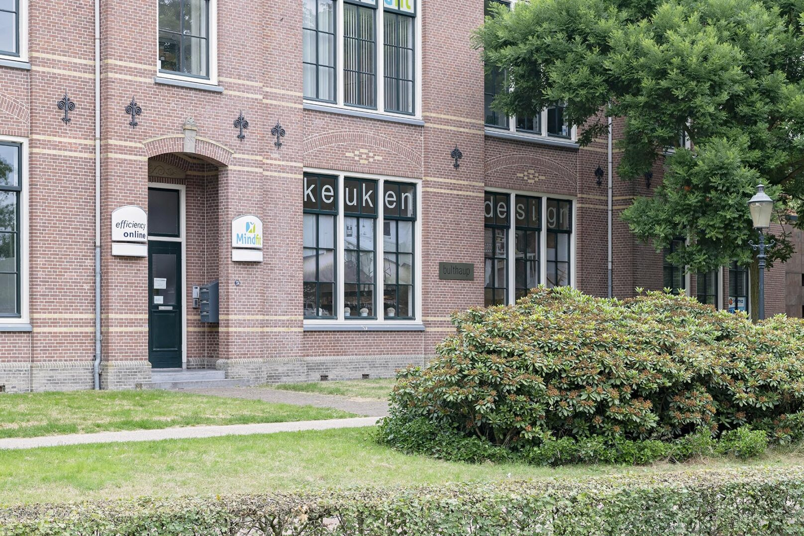

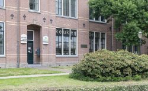

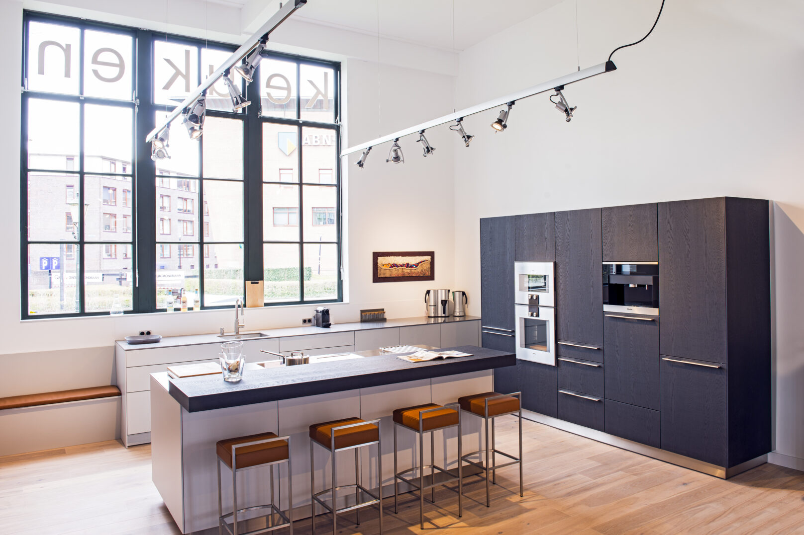

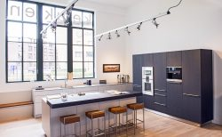

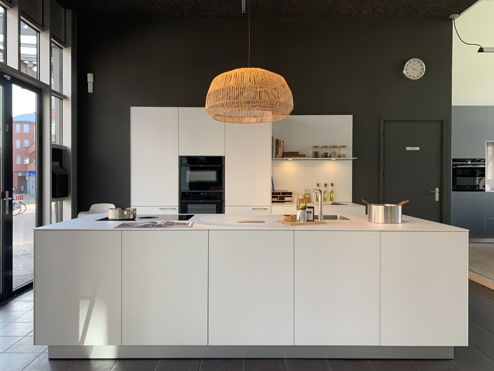

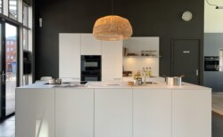

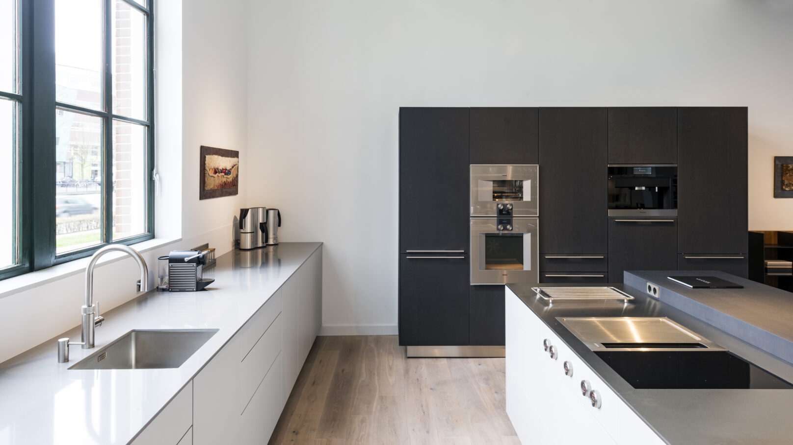

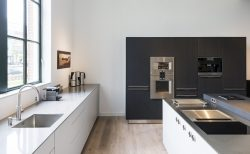

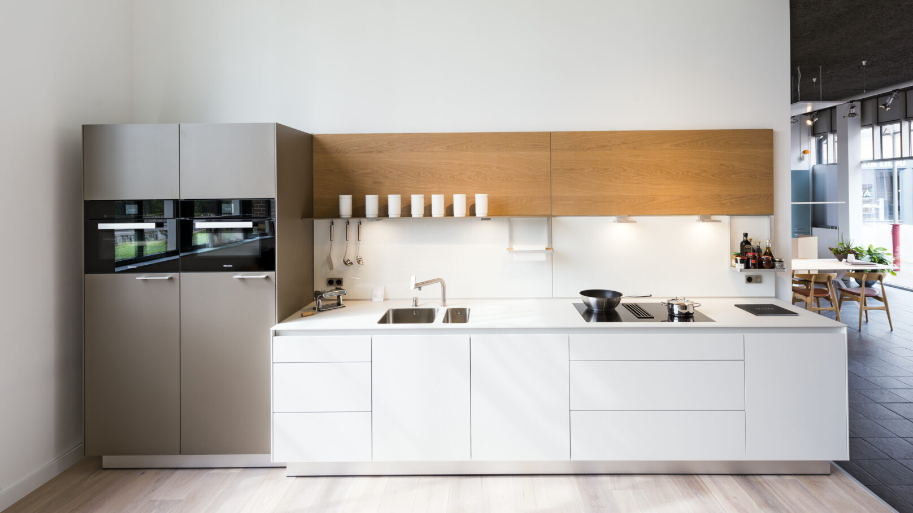

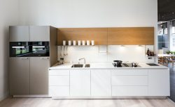

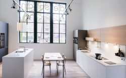

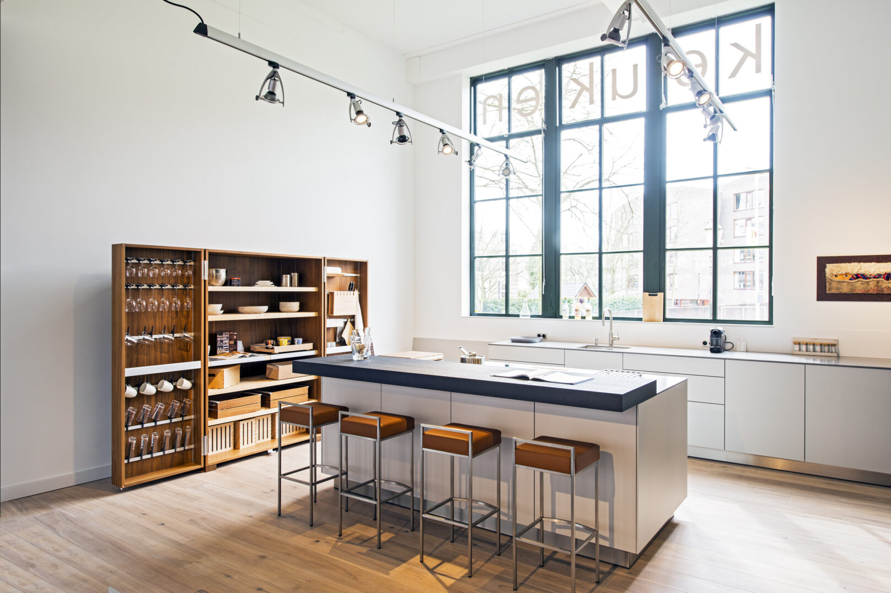

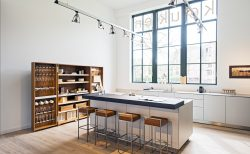

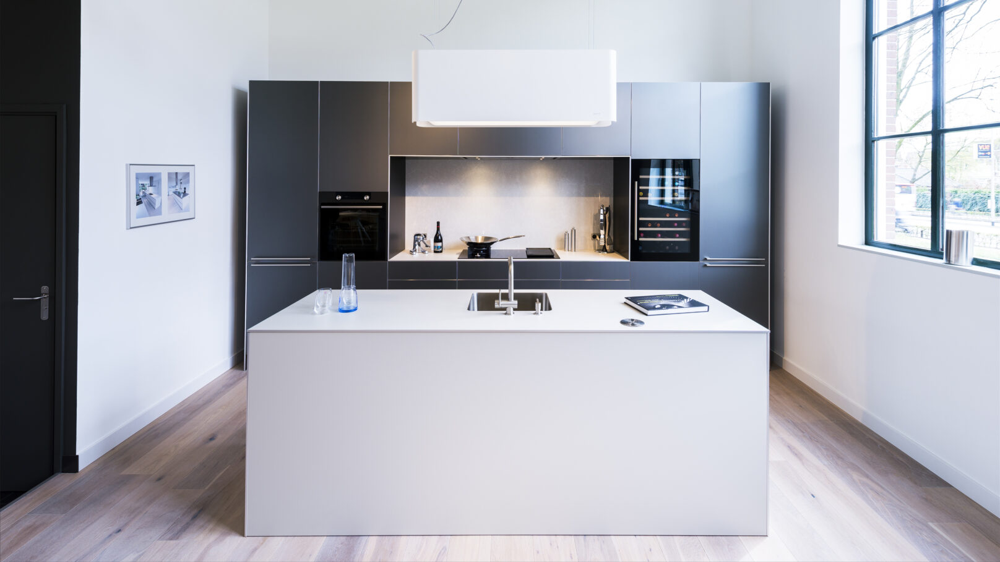

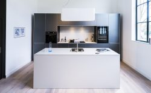

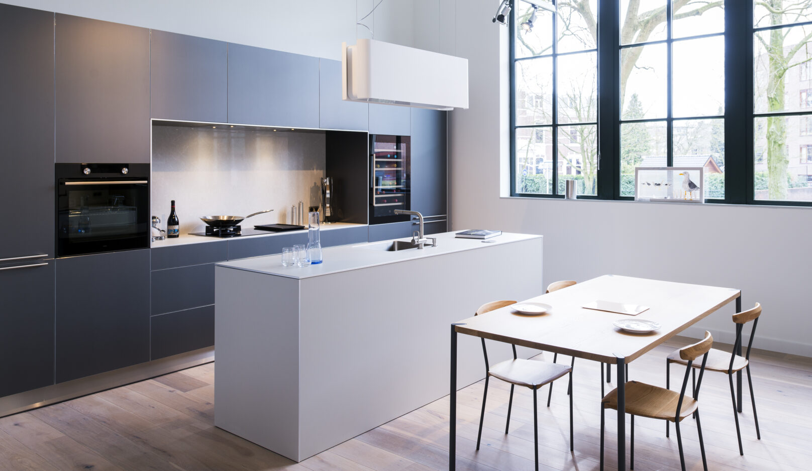

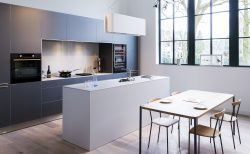

In 1985 ben ik begonnen als keukenadviseur, sinds 1998 heb ik mijn eigen keukenzaak.

Van hieruit ontwerp ik keukens op maat die helemaal passen bij uw woning en wensen. Een goede en praktische indeling en een creatieve oplossing zijn hierbij mijn uitgangspunten.

Bij een keuken is een goede logistiek heel belangrijk. Je komt binnen met tassen vol boodschappen, waar zet je die neer? Hoe ruim je de voorraad op en vul je de koelkast? Je maakt ’s ochtends ontbijt klaar, waar verzamel je de ingrediënten en maak je brood of ontbijtyoghurt klaar?

Je schenkt even wat drinken in of maakt koffie of thee. Allemaal handelingen waarbij je verschillende dingen pakt en weer opruimt. En dan nog het opruimen van de vaat en het afval.

Hoe kook je? Alleen of ook samen? Met weinig of veel ingrediënten, misschien uit eigen moestuin?

Kortom iedere gebruiker heeft zijn eigen wensen en gewoontes die van belang zijn om rekening mee te houden.

Omdat ik zelf van koken hou (ook uit eigen moestuin) kan ik me goed verplaatsen in de gebruiker en zo samen kijken wat de meest praktische en ergonomische oplossing binnen uw mogelijkheden zijn.

Daarnaast zijn de ruimtelijke invulling, materiaal, lichtval en kleurgebruik sterk bepalend. Vanuit mijn architectuuropleiding en ervaring help ik u graag met de juiste keuzes.

Van harte welkom voor een afspraak.

Filip Leenman

[Twitter](https://twitter.com/keukendesigner)[Instagram](https://www.instagram.com/stadshaege.keukendesign/)[Facebook](https://www.facebook.com/stadshaege/)
